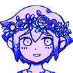
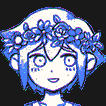
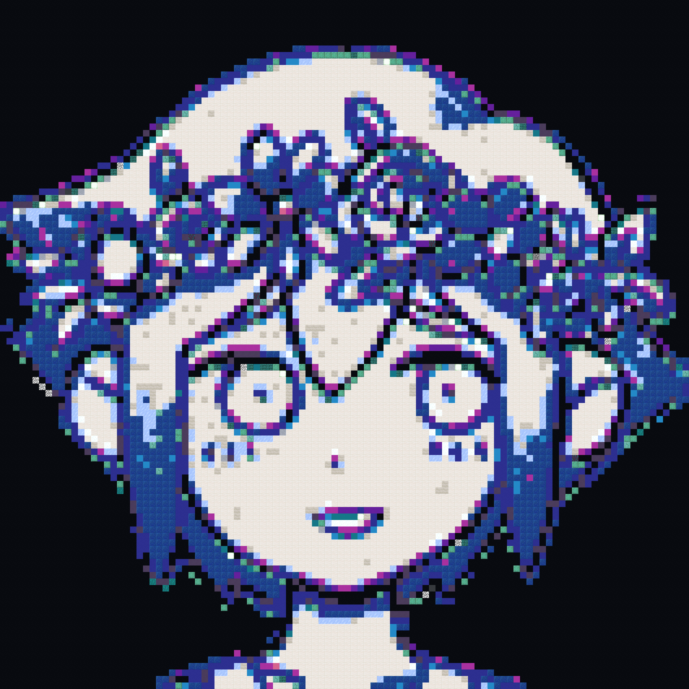

# colormapgenerator
 
A mod that takes a PNG image and generates a map using `/setblock` and `/fill` commands.

# Commands

- `imagefill` - Place an image with /setblock and /fill commands at a specified location. (You won't be able to move until it is done)
- `cancelimagefill` - Cancel the current running image fill.

- `colormap generate` - Generate a text file containing colormap data, used for debugging.
- `colormap whereis` - Print the location of the colormap text file.
- `colormap colorof` - Get the color of a block.
- `colormap blockof` - Get the block of a color.
- `colormap profile` - Profile different colormap generation algorithms.
- `colormap visualise` - Create a visualisation of the colormapped image.

# Examples

## Input

## Posterized Output

## Block Output
